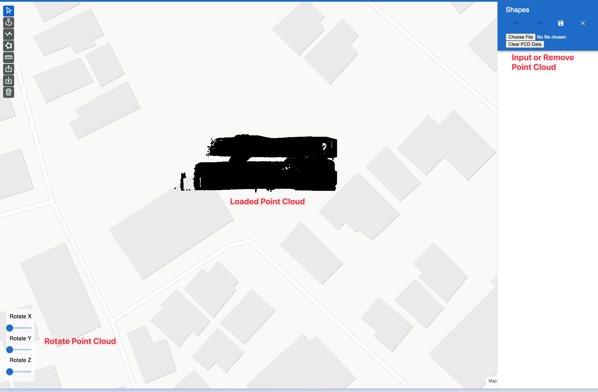
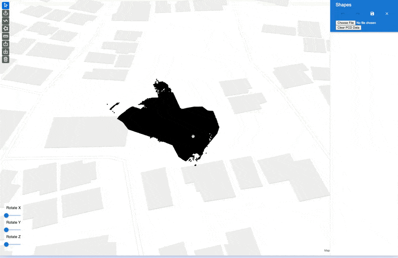
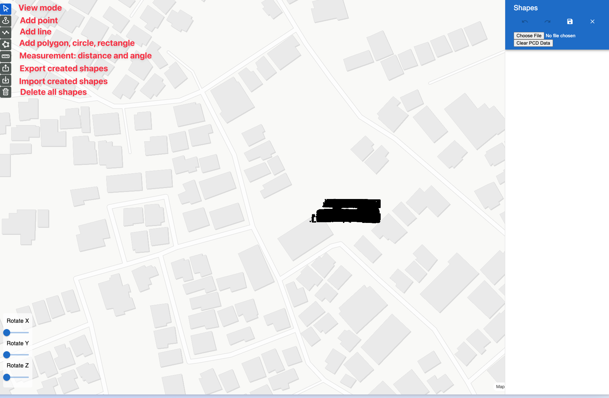
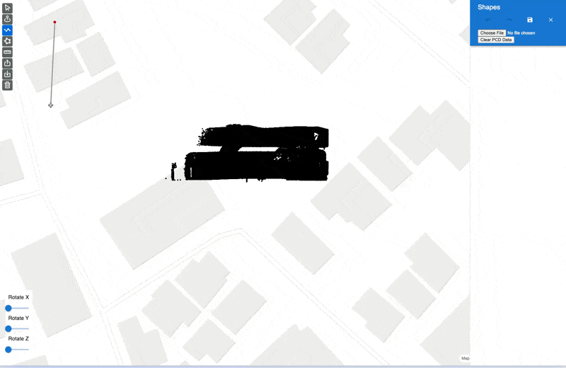
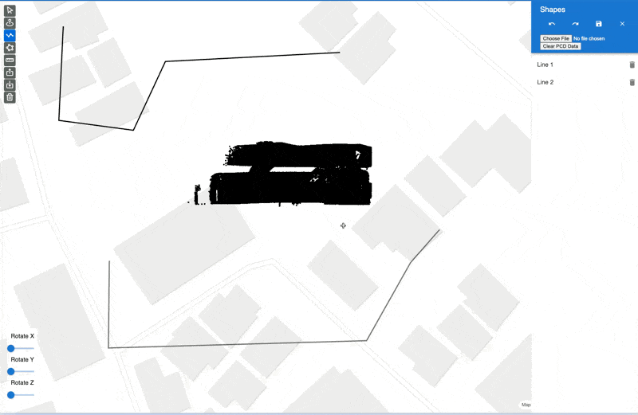
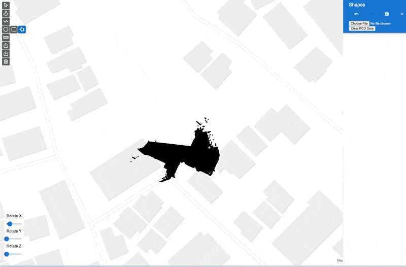
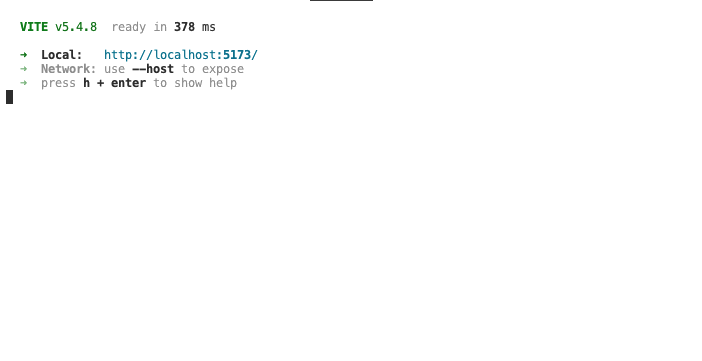

# DeckGL Demo Portfolio

This repository contains a simple portfolio website that demonstrates the use of DeckGL for creating interactive maps with point cloud data using LAS file format.

## Features

### Static Map

- Display a static map using MapLibre under the hood

### Point Cloud

- Load and display a point cloud using a LAS file format
- Remove the point cloud
- Rotate the point cloud
- Note:
  - The demo point cloud is the data from this repository: https://deck.gl/examples/point-cloud-layer
  - The demo support LAS v1.3. It does not support LAS v1.4 files.

### Mode

- Currently there are several modes that allow users to add vavious shapes: point, line, polygon, circle, rectangle.
- Besides , there are other utilities like: measurement, export/import created shapes with files.

### History

- On the right side is where users can view the list of shapes
- Control history with undo, redo
  
- Save the edit to local storage of browser or remove the local storage
  

## Scenario

- Users have a point cloud data of a building
- Users load the point cloud onto a map, rotate to put into correct orientation
- Users annotate the building with shapes, and use the annotation data for other purposes like map annotation for list of buildings.
  

- This is a simple scenario, building with Deck.GL to show the initial ideas and capabilities of the project.

## Getting Started

### Local Development

1. Node.js minimum version 20
1. Clone the repository `git clone https://github.com/hoang-ta/map-editor.git`
1. `cd map-editor`
1. `npm install`
1. `npm start`
   - Default start on http://localhost:5173/, or you can check the console for the local port
     
   - Use different port , example: port 3000 `npm start -- --port 3000`

### Use docker

The docker is using Ubuntu 20.04 and Node version 20 to run

1. Have Docker install
1. Clone the repository `git clone https://github.com/hoang-ta/map-editor.git`
1. `cd map-editor`
1. Build Docker image `docker build -t deck-demo-image .`
1. Run the container `docker run --name deck-demo-container -p 3000:3000 -d deck-demo-image`
1. Open http://localhost:3000/
